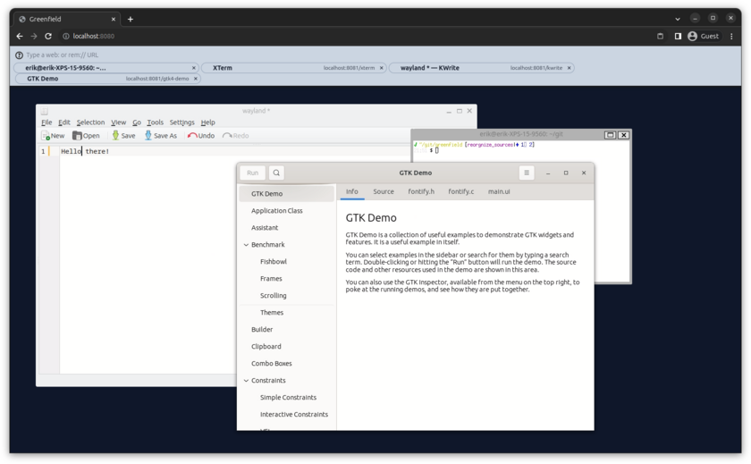

Greenfield
==
### The in-browser wayland compositor

Greenfield is the [Wayland compositor](https://en.wikipedia.org/wiki/Wayland_%28display_server_protocol%29) for the web. It runs native Linux applications remotely,
or WebAssembly applications directly in your browser.

Visit the [documentation](http://udev.be/greenfield), or have [a look on how it all began](https://wayouttheresoftware.blogspot.com/2023/07/some-history-about-greenfield.html)

