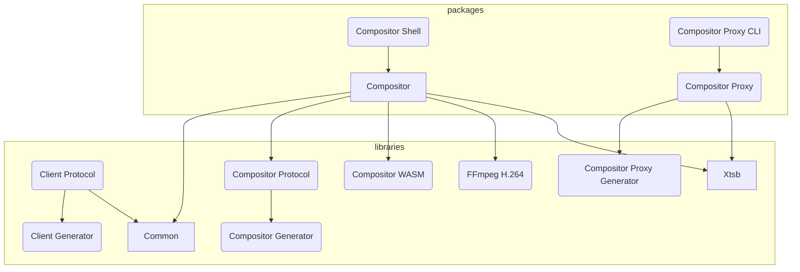

```mermaid
graph TD;
subgraph packages
    Compositor
    CoS(Compositor Shell)
    CoPr(Compositor Proxy)
    CoPrCli(Compositor Proxy CLI)
end
subgraph libraries
    ClP(Client Protocol)
    ClG(Client Generator)
    Common
    CoP(Compositor Protocol)
    CoG(Compositor Generator)
    CoPrG(Compositor Proxy Generator)
    CoWasm(Compositor WASM)
    ffmpeg(FFmpeg H.264)
    Xtsb
end

    ClP(Client Protocol)-->ClG(Client Generator);
    ClP(Client Protocol)-->Common;
    Compositor-->Common;
    Compositor-->CoP(Compositor Protocol);
    Compositor-->CoWasm(Compositor WASM);
    Compositor-->ffmpeg(FFmpeg H.264);
    Compositor-->Xtsb;
    CoS(Compositor Shell)-->Compositor;
    CoP(Compositor Protocol)-->CoG(Compositor Generator);
    CoPrCli(Compositor Proxy CLI)-->CoPr(Compositor Proxy)
    CoPr(Compositor Proxy)-->CoPrG(Compositor Proxy Generator);
    CoPr(Compositor Proxy)-->Xtsb;
```