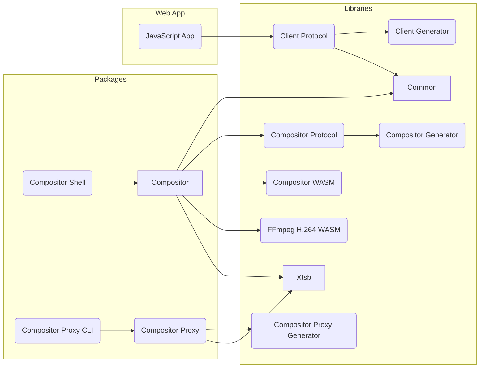

```mermaid
graph LR
subgraph Packages
    Compositor
    CoS(Compositor Shell)
    CoPrCli(Compositor Proxy CLI)
    CoPr(Compositor Proxy)
end
subgraph Libraries
    ClP(Client Protocol)
    Common
    CoP(Compositor Protocol)
    ClG(Client Generator)
    CoG(Compositor Generator)
    Xtsb
    CoPrG(Compositor Proxy Generator)
    CoWasm(Compositor WASM)
    ffmpeg(FFmpeg H.264 WASM)
end
subgraph Web App 
    JsApp(JavaScript App)-->ClP(Client Protocol)
end

    ClP(Client Protocol)-->ClG(Client Generator);
    ClP(Client Protocol)-->Common;
    Compositor-->Common;
    Compositor-->CoP(Compositor Protocol);
    Compositor-->CoWasm(Compositor WASM);
    Compositor-->ffmpeg(FFmpeg H.264 WASM);
    Compositor-->Xtsb;
    CoS(Compositor Shell)-->Compositor;
    CoP(Compositor Protocol)-->CoG(Compositor Generator);
    CoPrCli(Compositor Proxy CLI)-->CoPr(Compositor Proxy)
    CoPr(Compositor Proxy)-->CoPrG(Compositor Proxy Generator);
    CoPr(Compositor Proxy)-->Xtsb;
```