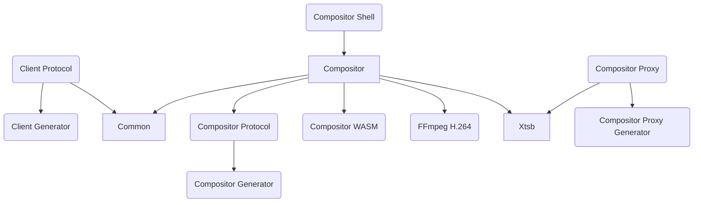

```mermaid
graph TD;
    ClP(Client Protocol)-->ClG(Client Generator);
    ClP(Client Protocol)-->Common;
    Compositor-->Common;
    Compositor-->CoP(Compositor Protocol);
    Compositor-->CoWasm(Compositor WASM);
    Compositor-->ffmpeg(FFmpeg H.264);
    Compositor-->Xtsb;
    CoS(Compositor Shell)-->Compositor;
    CoP(Compositor Protocol)-->CoG(Compositor Generator);
    CoPr(Compositor Proxy)-->CoPrG(Compositor Proxy Generator);
    CoPr(Compositor Proxy)-->Xtsb;
```