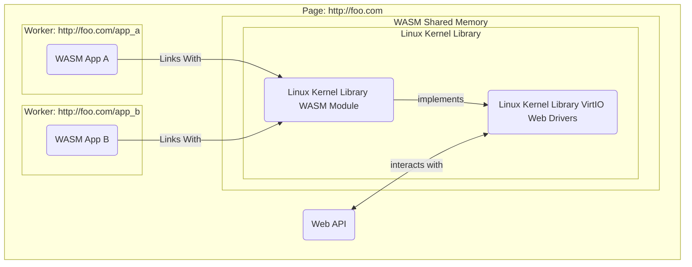

# Web Kernel

```mermaid
graph

subgraph Page: http://foo.com
    subgraph WASM Shared Memory
        subgraph Linux Kernel Library
            LklW(Linux Kernel Library WASM Module)-->|implements|LklWVIO(Linux Kernel Library VirtIO Web Drivers)
        end
    end

    subgraph Worker: http://foo.com/app_a
        AppA(WASM App A)-->|Links With|LklW
    end

    subgraph Worker: http://foo.com/app_b
        AppB(WASM App B)-->|Links With|LklW
    end

    WebAPI(Web API)<-->|interacts with|LklWVIO
end
```

# Web File System

