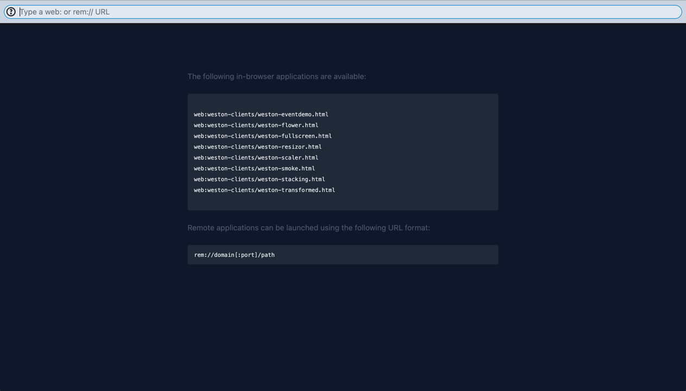

# Getting Started

## Compositor

Clone the repository.
```shell
git clone https://github.com/udevbe/greenfield.git
```

Inside the `greenfield` repository, we'll use `yarn` to install all dependencies and build all packages.

{: .important }
>Greenfield requires [`yarn >=3.6`.](https://yarnpkg.com/getting-started/install)

```shell
yarn install
yarn workspaces foreach --parallel --topological-dev \
--exclude @gfld/compositor-proxy \
--exclude @gfld/compositor-proxy-cli \
run build
```

{: .note }
>The build excludes `compositor-proxy` packages as these only build on Linux environments.
>We'll come back to this under the chapter [Remote Applications](#remote-applications).

After all packages have been build, we can spin up the Greenfield compositor shell.
```shell
yarn workspace @gfld/shell run start
```
Open a browser and point it at [http://localhost:8080](http://localhost:8080).



Unfortunately at this point we can't run any applications because there are none available. Let's fix that in the next steps.

## Web Applications

Web applications in Greenfield can either be native Wayland applications compiled to WebAssembly or pure JavaScript applications.
Greenfield provides a few examples that we can use.

- `examples/sdk` shows the usage of the [Greenfield WebAssembly SDK](/greenfield/pages/sdk) in porting existing native desktop applications to Greenfield.
- `examples/webapps` has some ready-to-run examples.

We'll begin simple and start with `examples/webapps/simple-shm`.

```shell
yarn workspace @gfld/demo-webapp-simple-shm start
```

The Greenfield Compositor Shell maps the URL `web:simple-shm` to `http://localhost:9001`, which is the 
address of this example web app. Type this URL in the Greenfield address bar and some psychedelic circles should appear.
To exit the application, press the `esc` key.

{: .note }
> The Compositor Shell uses a reverse proxy config to map `web:simple-shm` to `http://localhost:9001`.

{: .note }
> You might have noticed that `web:simple-shm` is not a normal looking URL as the hostname is missing. The reason for this is that
> Greenfield web apps can only run inside same-origin iframes because of features like `SharedArrayBuffer`. Greenfield thus fills
> in the hostname for you, so you don't having to type out the same hostname each time.

As mentioned earlier, there are also WebAssembly examples available. So let's build something more exciting.

Inside `examples/sdk/weston`
```shell
./build.sh
```

{: .important }
> Building the WebAssembly examples require a working SDK. Head over to the SDK [documentation](/greenfield/pages/sdk) to set it up.

If all went well, a new `build/clients` directory has appeared with a bunch of `.html`, `.js` and `.wasm`. Spin up a web server so these can be served.

```shell
yarn workspace @gfld/weston-clients preview
```

This makes the following URLs available. Enter any of these in the URL bar to see a WebAssembly desktop application.

```shell
web:weston-clients/weston-eventdemo.html
web:weston-clients/weston-flower.html
web:weston-clients/weston-fullscreen.html
web:weston-clients/weston-resizor.html
web:weston-clients/weston-scaler.html
web:weston-clients/weston-smoke.html
web:weston-clients/weston-stacking.html
web:weston-clients/weston-transformed.html
```

## Remote Applications
